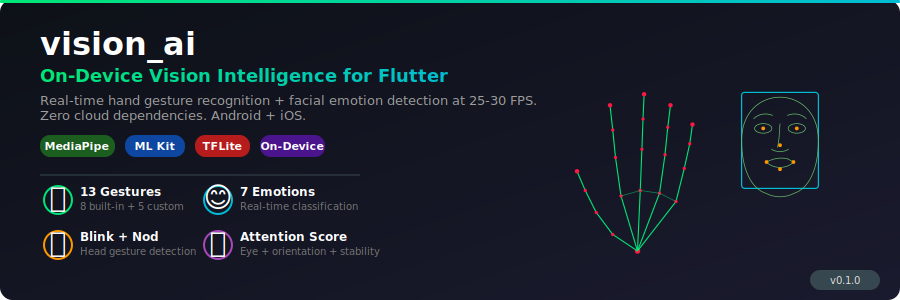
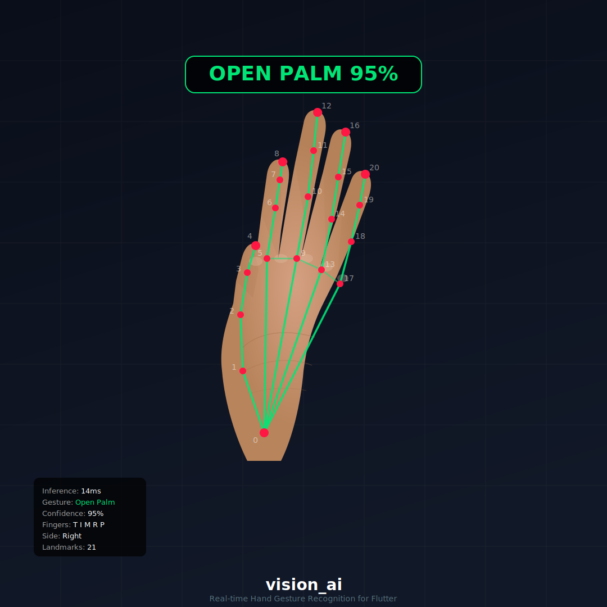
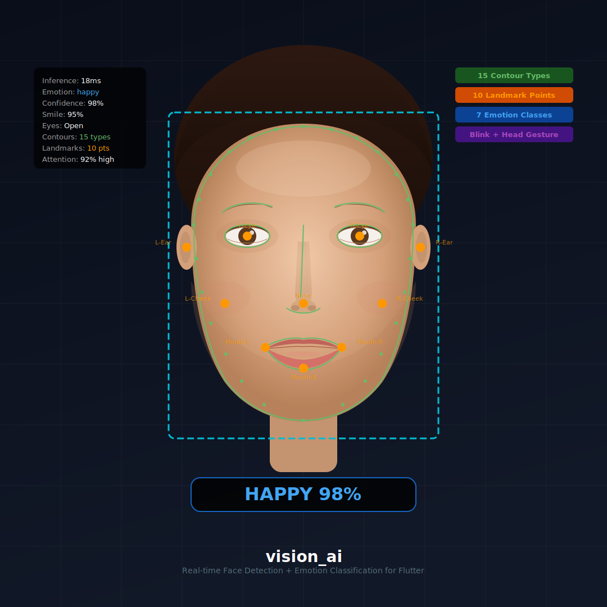
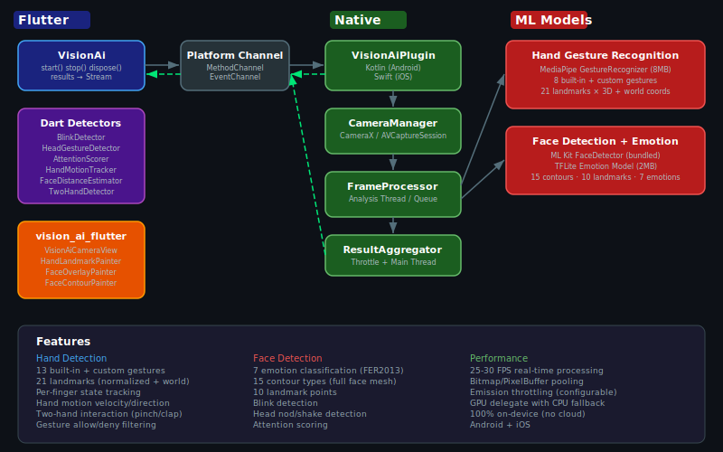

# vision_ai

<p align="center">
  
</p>

**On-device hand gesture recognition + facial emotion detection for Flutter.** Runs at 25-30 FPS with zero cloud dependencies. Android + iOS.

[](https://pub.dev/packages/vision_ai)
[](LICENSE)

---

## What You Can Build

| Use Case | Features Used |
|---|---|
| **Sign language interpreter** | 13 gestures + custom finger patterns + hand landmarks |
| **Driver drowsiness alert** | Blink detection + attention scoring + head nod detection |
| **Touchless kiosk control** | Hand motion tracking + gesture recognition + two-hand interaction |
| **Online proctoring** | Attention scoring + face tracking + head nod/shake |
| **Fitness form checker** | Hand/body position via landmarks + world coordinates |
| **Interactive children's app** | Emotion detection + gesture games + two-hand clap detection |
| **Accessibility controller** | Custom gestures mapped to app actions + blink-to-click |
| **Live streaming reactions** | Real-time emotion overlay + gesture-triggered effects |
| **Face-to-face distance monitor** | Face distance estimation + attention level |
| **AR filter trigger** | Face contours + landmarks + emotion-driven overlays |

---

## Packages

| Package | Description | pub.dev |
|---|---|---|
| [`vision_ai`](packages/vision_ai/) | Core plugin — camera, ML models, detectors, platform channels | [](https://pub.dev/packages/vision_ai) |
| [`vision_ai_flutter`](packages/vision_ai_flutter/) | UI widgets — camera view, skeleton painters, label overlays | [](https://pub.dev/packages/vision_ai_flutter) |

---

## Feature Overview

<table>
<tr>
<td width="50%">



</td>
<td width="50%">



</td>
</tr>
</table>

### Hand Detection
- **13 built-in gestures** — fist, open palm, peace, thumbs up/down, pointing up, I love you, ok, counting 1-5
- **Custom gestures** — define any finger pattern with wildcards
- **21 hand landmarks** — normalized [0,1] image coords + world coordinates in meters
- **Per-finger tracking** — extended/closed for all 5 fingers
- **Hand bounding box** — computed from landmark min/max
- **Motion tracking** — speed, direction (8 compass), velocity components
- **Two-hand interaction** — pinch, clap, hands touching
- **Gesture filtering** — allow/deny lists, per-gesture confidence thresholds
- **World measurements** — real-world distances in cm (pinch gap, hand span)

### Face Detection
- **7 emotion classes** — happy, sad, angry, surprised, disgusted, fearful, neutral
- **15 face contour types** — full face mesh outline, eyes, lips, eyebrows, nose, cheeks
- **10 landmark points** — eyes, nose, mouth corners, ears, cheeks
- **Face tracking** — stable IDs across frames
- **Blink detection** — per-eye with duration in ms
- **Head nod/shake** — yes/no gesture from Euler angle oscillations
- **Distance estimation** — camera-to-face distance via pinhole model (cm + zones)
- **Attention scoring** — eye openness + face orientation + head stability → 0-100% score
- **Accurate mode** — ML Kit high-quality detection for distant/angled faces

### Performance
- 25-30 FPS on mid-range devices
- GPU acceleration with automatic CPU fallback
- Buffer pooling to minimize GC pressure
- Configurable emission throttling
- 100% on-device — no server, no API keys, no internet

---

## Platform Support

| Platform | Status | Min Version | Notes |
|---|---|---|---|
| Android | Stable | API 24 (Android 7.0) | Tested on Samsung Galaxy A15, multiple devices |
| iOS | Beta | iOS 12.0 | Implementation complete, needs community testing (see [Contributing](#contributing)) |
| Web | Planned | — | MediaPipe WASM + TFJS feasible, not yet implemented |

---

## Quick Start

```yaml
# pubspec.yaml
dependencies:
  vision_ai: ^0.1.0
  vision_ai_flutter: ^0.1.0  # optional: pre-built overlay widgets
```

### Android Setup

```xml
<!-- android/app/src/main/AndroidManifest.xml -->
<uses-permission android:name="android.permission.CAMERA" />
```

**Release builds:** MediaPipe crashes with R8 code shrinking enabled. Add this to `android/app/build.gradle.kts`:

```kotlin
android {
    buildTypes {
        release {
            isMinifyEnabled = false
            isShrinkResources = false
        }
    }
}
```

### iOS Setup

```xml
<!-- ios/Runner/Info.plist -->
<key>NSCameraUsageDescription</key>
<string>Camera access is needed for hand gesture and face detection.</string>
```

### Minimal Example

```dart
import 'package:vision_ai/vision_ai.dart';

final vision = VisionAi(
  hand: HandConfig(maxHands: 2),
  face: FaceConfig(detectEmotion: true),
);

final textureId = await vision.start();

// Render camera preview
Texture(textureId: textureId);

// Listen to results
vision.results.listen((result) {
  final hand = result.primaryHand;
  if (hand != null) {
    print('Gesture: ${hand.gesture.name} (${(hand.gestureConfidence * 100).toStringAsFixed(0)}%)');
  }
  
  final face = result.primaryFace;
  if (face != null) {
    print('Emotion: ${face.emotion.name}');
  }
});

// Clean up
await vision.stop();
await vision.dispose();
```

For detailed API documentation, see the [vision_ai package README](packages/vision_ai/README.md).

---

## Architecture



All ML inference runs on-device:

- **Hand gestures**: MediaPipe Gesture Recognizer (~8MB, GPU delegate, LIVE_STREAM mode)
- **Face detection**: Google ML Kit Face Detection (bundled by platform)
- **Emotion**: TFLite CNN on FER2013 (~2MB, 7 classes)

Camera frames are processed natively (CameraX on Android, AVFoundation on iOS). Only lightweight results (landmarks, labels, scores) cross the platform channel — raw frame data never leaves the native side.

**Threading model:**
- Camera frames arrive on a dedicated background thread/queue
- MediaPipe runs async (result via callback)
- ML Kit runs synchronously on the same thread
- Results are dispatched to the main/UI thread for Flutter's EventSink
- All ML resources are closed on the processing thread to avoid racing with in-flight inference

---

## Try It Before Using It

The package ships with a full demo app with a settings panel for every feature. No code needed — just run and toggle:

```bash
git clone https://github.com/OttomanDeveloper/vision_ai.git
cd vision_ai/packages/vision_ai/example
flutter run
```

The example includes toggles for hand/face detection, all 6 Dart detectors, overlay visibility, camera settings, gesture filtering, accurate mode, and more. Settings are grouped into cards (Hand Detection, Face Detection, Camera, Overlays) that show/hide related options when you toggle the parent feature on or off.

---

## Contributing

We welcome contributions, especially for:

### iOS Testing
iOS implementation is complete but has not been tested on physical devices yet. If you have a Mac + iPhone/iPad, we'd appreciate:
1. Run the example app on your iOS device
2. Test hand gestures, face detection, emotion classification
3. Share any crash logs or issues on [GitHub Issues](https://github.com/OttomanDeveloper/vision_ai/issues)
4. Tag your issue with `ios` label

### Other Ways to Help
- Report bugs with logs and device info
- Suggest new features or gesture patterns
- Improve the emotion model (the current FER2013 model has limited accuracy for disgust/fear)
- Help with web platform support (MediaPipe WASM + TFJS)
- Add unit tests for Dart-only detectors

### Development Setup

This is a melos monorepo:

```bash
# Install melos
dart pub global activate melos

# Bootstrap all packages
melos bootstrap

# Run analyzer across all packages
melos run analyze

# Run tests
melos run test
```

---

## License

Apache 2.0 — see [LICENSE](LICENSE) and [NOTICE](NOTICE).

If you fork or redistribute, you must retain the copyright notice and state any changes made.
